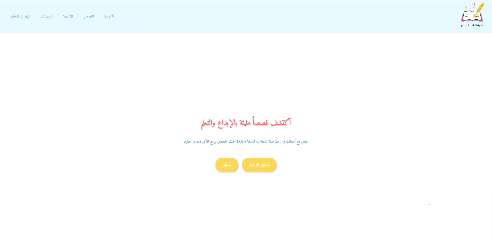
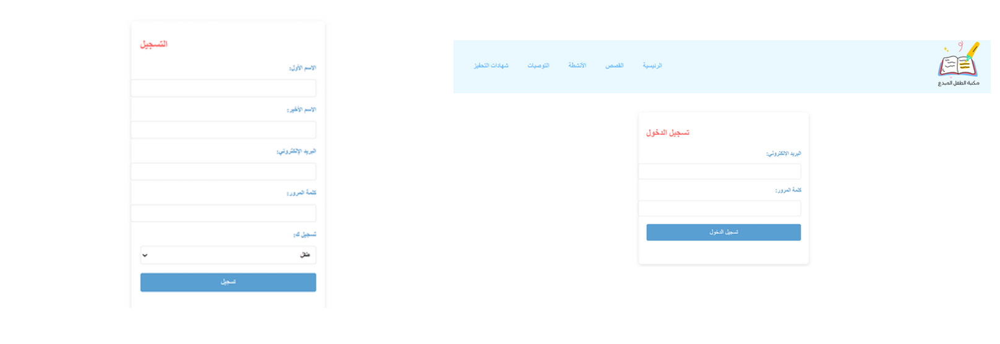

# Kids Library System

An interactive web-based digital library designed for children to explore stories, track reading progress, and enjoy a safe and engaging learning environment.

---

## Project Overview

The Kids Library System is a full-stack web application developed to encourage reading among children through an interactive and user-friendly platform.

The system supports multiple user roles including children, parents, and administrators. Children can browse stories and activities, while administrators can manage content and user data.

---

## Features

- User registration and login system
- Parent and child account management
- Story browsing and reading
- Reading progress tracking
- Interactive activities section
- Recommendation system
- Admin dashboard
- Certificate generation
- Responsive and child-friendly UI
- CRUD operations for stories and users

---

## Technologies Used

### Frontend
- HTML
- CSS
- JavaScript

### Backend
- PHP

### Database
- MySQL

### Tools & Platforms
- XAMPP
- VS Code

---

## System Architecture

The project follows a three-layer architecture:

### Presentation Layer
Handles the user interface for:
- Children
- Parents
- Administrators

### Application Layer
Handles:
- Authentication
- User management
- Story management
- Reading progress tracking
- Recommendation services

### Data Layer
Stores:
- User data
- Stories
- Activities
- Reading history

---

## Screenshots

### Home Page


### Login Page


### Dashboard


### Stories Page


---

## Project Structure

```txt
kids-library-system/
│
├── frontend/
├── database/
├── assets/
├── screenshots/
└── docs/
